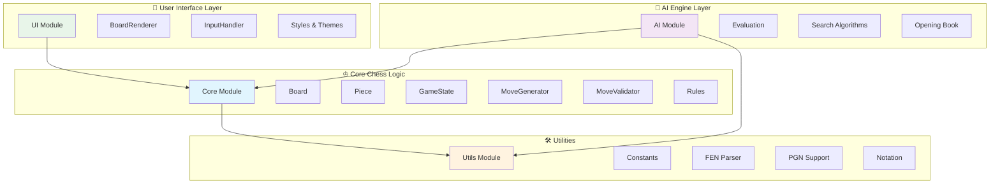

# ♔ JS Chess Engine

> **A pure JavaScript chess engine inspired by the legendary Atari Video Chess, designed to outplay the original through superior AI and modern web technologies.**

[](https://github.com/jane-alesi/js-chess-engine/actions/workflows/ci.yml)
[](https://github.com/jane-alesi/js-chess-engine/actions/workflows/auto-fix.yml)
[](LICENSE)
[](https://developer.mozilla.org/en-US/docs/Web/JavaScript)
[](https://nodejs.org/)
[](https://www.chessprogramming.org/)
[](https://github.com/jane-alesi/js-chess-engine/issues)
[](CONTRIBUTING.md)

---

## 📖 Project Description

### The Vision

In 1979, Atari released Video Chess for the Atari 2600 - a groundbreaking achievement that brought chess to home consoles in just 4KB of ROM. This project pays homage to that pioneering spirit while leveraging modern JavaScript capabilities to create a chess engine that can outthink and outplay its legendary predecessor.

### What Problem Does This Solve?

**For Chess Enthusiasts:**
- Provides a pure JavaScript chess implementation that runs entirely in the browser
- Offers an AI opponent with adjustable difficulty levels
- Enables chess learning through position analysis and move suggestions

**For Developers:**
- Demonstrates advanced JavaScript patterns including ES2022 private fields
- Showcases modular architecture with clean separation of concerns
- Provides a comprehensive testing framework for complex game logic

**For AI Researchers:**
- Implements classic game AI algorithms (Minimax with Alpha-Beta pruning)
- Offers a platform for experimenting with chess evaluation functions
- Enables comparison with historical chess engines

### The Technology

Built with modern JavaScript (ES2022), this engine features:

- **Pure JavaScript Implementation** - No external chess libraries, everything built from scratch
- **Modular Architecture** - Clean separation between core logic, UI, and AI components
- **Advanced AI Engine** - Minimax search with Alpha-Beta pruning for intelligent gameplay
- **Comprehensive Testing** - Full test coverage ensuring reliable chess rule implementation
- **Browser-Native** - Runs entirely in modern web browsers without server dependencies

### The Challenge

Can a modern JavaScript implementation, with access to decades of chess programming knowledge and unlimited memory, create an engine that surpasses the original Atari Video Chess? This project aims to prove that with careful design and modern algorithms, we can honor the past while pushing the boundaries of what's possible in browser-based chess.

---

## 🚀 Getting Started

### Prerequisites

Before you begin, ensure you have the following installed:

- **Node.js** (v16.0.0 or higher) - [Download here](https://nodejs.org/)
- **npm** (comes with Node.js)
- **Modern web browser** (Chrome, Firefox, Safari, Edge)

### Installation

1. **Clone the repository**

    ```bash
    git clone https://github.com/jane-alesi/js-chess-engine.git
    ```

2. **Navigate to the project directory**

    ```bash
    cd js-chess-engine
    ```

3. **Install dependencies**

    ```bash
    npm install
    ```

4. **Verify installation**
    ```bash
    npm run quality:check
    npm test
    ```

### Usage

#### Running the Chess Engine

1. **Start the development server**

    ```bash
    npm start
    ```

2. **Open your browser**

    Navigate to `http://localhost:8080` to see the chess engine in action.

#### Development Commands
```bash
# Development server
npm start                # Start live development server on port 8080

# Testing
npm test                 # Run all tests
npm run test:watch       # Run tests in watch mode
npm run test:coverage    # Run tests with coverage report

# Code Quality
npm run quality:check    # Check code formatting and linting
npm run quality:fix      # Auto-fix formatting and linting issues
npm run lint:check       # Check ESLint rules (zero warnings)
npm run format:check     # Check Prettier formatting

# Security
npm run security-check   # Check for security vulnerabilities
npm run security-fix     # Fix security vulnerabilities
```

#### Project Structure
```
js-chess-engine/
├── src/
│   ├── core/           # Chess logic foundation
│   │   ├── Board.js              # Board representation and state
│   │   ├── Piece.js              # Piece definitions and validation
│   │   ├── GameState.js          # Game state management
│   │   ├── MoveGenerator.js      # Move generation algorithms
│   │   └── ...
│   ├── ui/               # User interface components
│   │   ├── BoardRenderer.js      # Visual board rendering
│   │   ├── InputHandler.js       # User input processing
│   │   └── styles.css            # Styling and themes
│   ├── ai/               # AI engine (future implementation)
│   └── utils/            # Shared utilities
│       └── Constants.js          # Game constants and piece values
├── tests/              # Test files
├── index.html          # Main HTML entry point
└── package.json        # Project configuration
```

#### Quick Start Guide

1. **For Players**: Simply run `npm start` and open `http://localhost:8080` to play chess
2. **For Developers**: Check out the [open issues](https://github.com/jane-alesi/js-chess-engine/issues) to contribute
3. **For AI Researchers**: Explore the `src/core/` directory for chess logic implementation

---

## 🗺️ Development Roadmap

Our development follows a structured, phase-based approach with clear milestones and priorities:

### **Phase 1: Documentation & Project Management** ✅ **COMPLETED**

_Timeline: June 2025_
- ✅ **Professional README.md** ([#35](https://github.com/jane-alesi/js-chess-engine/issues/35)) - Impactful header and project description
- ✅ **Installation & Usage Guide** ([#36](https://github.com/jane-alesi/js-chess-engine/issues/36)) - Comprehensive setup instructions
- ✅ **Architecture Documentation** ([#37](https://github.com/jane-alesi/js-chess-engine/issues/37)) - Mermaid diagrams and contribution guidelines
- ✅ **Status Badges & Roadmap** ([#38](https://github.com/jane-alesi/js-chess-engine/issues/38)) - CI/CD transparency and project roadmap

**Outcome**: Complete professional documentation foundation enabling efficient contributor onboarding.

---

### **Phase 2: Core Move Generation** 🔄 **IN PROGRESS**

_Timeline: July-August 2025 | Priority: HIGH_

- ✅ **Pawn Move Generation** ([#4](https://github.com/jane-alesi/js-chess-engine/issues/4)) - Forward, double, and capture moves
- ✅ **Rook Move Generation** ([#2](https://github.com/jane-alesi/js-chess-engine/issues/2)) - Horizontal and vertical movement patterns
- ✅ **Bishop Move Generation** ([#1](https://github.com/jane-alesi/js-chess-engine/issues/1)) - Diagonal movement patterns
- ✅ **Knight Move Generation** ([#9](https://github.com/jane-alesi/js-chess-engine/issues/9)) - L-shaped movement patterns
- ✅ **King Move Generation** ([#7](https://github.com/jane-alesi/js-chess-engine/issues/7)) - Single-square movement patterns
- 📅 **Queen Move Generation** ([#6](https://github.com/jane-alesi/js-chess-engine/issues/6)) - Combined rook and bishop patterns

**Current Status**: ✅ Pawn, Rook, Bishop, Knight, and King moves fully implemented with comprehensive testing  
**Next Priority**: Queen move generation (the final piece for this phase).

---

### **Phase 3: Core Game Logic** 📅 **PLANNED**

_Timeline: September-October 2025 | Priority: MEDIUM_
- 📅 **Enhanced Move Validation** - Self-check prevention and legal move filtering
- 📅 **Check Detection** - King threat analysis and validation
- 📅 **Checkmate & Stalemate** - Game ending condition detection
- 📅 **Special Moves Implementation**:
    - Castling (kingside and queenside)
    - En passant capture
    - Pawn promotion
- 📅 **Game Flow Orchestration** ([#14](https://github.com/jane-alesi/js-chess-engine/issues/14)) - Complete game state management

**Dependencies**: Requires completion of Phase 2 (all piece move generation).

---

### **Phase 4: AI Implementation** 📅 **PLANNED**

_Timeline: November 2025-January 2026 | Priority: MEDIUM_
- 📅 **Basic AI Foundation**:
    - Random move selection
    - Legal move filtering
    - Basic position evaluation
- 📅 **Minimax Algorithm**:
    - Recursive game tree search
    - Alpha-Beta pruning optimization
    - Configurable search depth
- 📅 **Position Evaluation**:
    - Material value calculation
    - Positional factors (center control, piece development)
    - King safety assessment
- 📅 **Difficulty Levels**:
    - Beginner (depth 1-2)
    - Intermediate (depth 3-4)
    - Advanced (depth 5-6)
    - Expert (depth 7+ with optimizations)

**Target**: AI capable of defeating the original Atari Video Chess.

---

### **Phase 5: User Interface & Experience** 📅 **FUTURE**

_Timeline: February-March 2026 | Priority: LOW_
- 📅 **Interactive Board Enhancements**:
    - Drag-and-drop piece movement
    - Move highlighting and validation
    - Animated piece transitions
- 📅 **Game Features**:
    - Move history and notation
    - Position analysis tools
    - Save/load game functionality
- 📅 **Visual Improvements**:
    - Multiple board themes
    - Piece set customization
    - Responsive design for mobile
- 📅 **Accessibility**:
    - Keyboard navigation
    - Screen reader support
    - High contrast modes

---

### **Phase 6: Performance & Advanced Features** 📅 **FUTURE**

_Timeline: April-June 2026 | Priority: LOW_
- 📅 **Performance Optimizations**:
    - Web Workers for AI computation
    - Transposition tables for position caching
    - Move ordering improvements
    - Bitboard representation (optional)
- 📅 **Advanced AI Features**:
    - Opening book integration
    - Endgame tablebase support
    - Neural network evaluation (experimental)
- 📅 **Additional Features**:
    - Multiplayer support
    - Tournament modes
    - Chess variant support (Chess960, King of the Hill)
    - Engine vs. engine matches

---

### **Progress Tracking**

| Phase        | Completion | Key Milestones                                                   | Target Date   |
|--------------|------------|------------------------------------------------------------------|---------------|
| **Phase 1**  | ✅ 100%    | Professional documentation complete                              | ✅ June 2025  |
| **Phase 2**  | 🔄 90%     | Pawn, Rook, Bishop, Knight, King moves implemented, 1 piece remaining | August 2025   |
| **Phase 3**  | 📅 0%      | Awaiting Phase 2 completion                                      | October 2025  |
| **Phase 4**  | 📅 0%      | Awaiting Phase 3 completion                                      | January 2026  |
| **Phase 5**  | 📅 0%      | UI/UX enhancements                                               | March 2026    |
| **Phase 6**  | 📅 0%      | Performance & advanced features                                  | June 2026     |

### **Success Metrics**

- **Technical**: All tests passing, zero linting errors, comprehensive coverage
- **Functional**: Complete chess rule implementation with legal move validation
- **Performance**: AI response time < 1 second for depth 4 search
- **Quality**: Code review approval, documentation completeness
- **Legacy Goal**: Demonstrably superior play compared to original Atari Video Chess

---

## 🏛️ Current Status

This project is actively under development with a focus on:
✅ **Core Foundation Complete**

- Board representation and piece management
- Move generation for pawns (with comprehensive testing)
- Game state tracking and validation
- Modern ES2022 implementation with private fields

🔄 **In Progress**

- Move generation for all remaining pieces (Rook, Bishop, Knight, King, Queen)
- Advanced game rules (castling, en passant, promotion)
- Check and checkmate detection

📖 **Coming Next**

- AI opponent with multiple difficulty levels
- Position evaluation and strategic play
- Interactive web interface
- Performance optimizations

---

## 🏗️ Architecture

The engine follows a modular design inspired by classic chess programming principles, with clear separation of concerns and unidirectional data flow:



### Architecture Principles

- **Layered Design** - Clear separation between UI, AI, Core Logic, and Utilities
- **Unidirectional Data Flow** - Data flows from UI/AI → Core → Utils
- **Modular Independence** - Each module can be developed and tested independently
- **Future Extensibility** - Architecture supports advanced AI features and UI enhancements

### Module Responsibilities

- **Core Module** - Pure chess logic, rules, and game state management
- **UI Module** - Visual representation and user interaction handling
- **AI Module** - Artificial intelligence, search algorithms, and position evaluation
- **Utils Module** - Shared utilities, constants, and helper functions

---

## 📜 License

This project is licensed under the **MIT License** - see the [LICENSE](LICENSE) file for details.

### License Summary

- ✅ **Commercial use** - Use in commercial projects
- ✅ **Modification** - Modify and adapt the code
- ✅ **Distribution** - Share and distribute freely
- ✅ **Private use** - Use for personal projects
- ❌ **License and copyright notice** - Include original license
- ❌ **No warranty** - Software provided "as is"

---

## 🙏 Acknowledgments

- **Atari Video Chess** - The legendary inspiration for this project
- **Chess Programming Community** - For decades of shared knowledge and algorithms
- **satware® AI** - Advanced AI development and the Alesi AGI ecosystem

---

**Project Link:** [https://github.com/jane-alesi/js-chess-engine](https://github.com/jane-alesi/js-chess-engine)

_Built with ♔ by the chess programming community_
