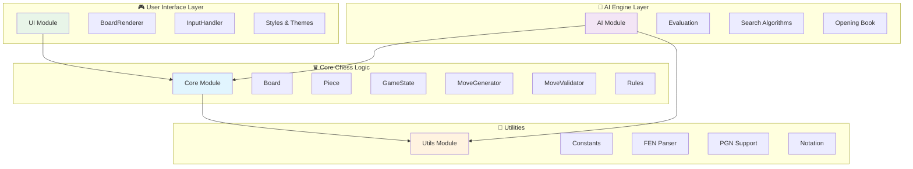

# ♛ JS Chess Engine

> **A pure JavaScript chess engine inspired by the legendary Atari Video Chess, designed to outplay the original through superior AI and modern web technologies.**

[](LICENSE)
[](https://developer.mozilla.org/en-US/docs/Web/JavaScript)
[](https://www.chessprogramming.org/)

---

## 🎯 Project Description

### The Vision

In 1979, Atari released Video Chess for the Atari 2600 - a groundbreaking achievement that brought chess to home consoles in just 4KB of ROM. This project pays homage to that pioneering spirit while leveraging modern JavaScript capabilities to create a chess engine that can outthink and outplay its legendary predecessor.

### What Problem Does This Solve?

**For Chess Enthusiasts:**

- Provides a pure JavaScript chess implementation that runs entirely in the browser
- Offers an AI opponent with adjustable difficulty levels
- Enables chess learning through position analysis and move suggestions

**For Developers:**

- Demonstrates advanced JavaScript patterns including ES2022 private fields
- Showcases modular architecture with clean separation of concerns
- Provides a comprehensive testing framework for complex game logic

**For AI Researchers:**

- Implements classic game AI algorithms (Minimax with Alpha-Beta pruning)
- Offers a platform for experimenting with chess evaluation functions
- Enables comparison with historical chess engines

### The Technology

Built with modern JavaScript (ES2022), this engine features:

- **Pure JavaScript Implementation** - No external chess libraries, everything built from scratch
- **Modular Architecture** - Clean separation between core logic, UI, and AI components
- **Advanced AI Engine** - Minimax search with Alpha-Beta pruning for intelligent gameplay
- **Comprehensive Testing** - Full test coverage ensuring reliable chess rule implementation
- **Browser-Native** - Runs entirely in modern web browsers without server dependencies

### The Challenge

Can a modern JavaScript implementation, with access to decades of chess programming knowledge and unlimited memory, create an engine that surpasses the original Atari Video Chess? This project aims to prove that with careful design and modern algorithms, we can honor the past while pushing the boundaries of what's possible in browser-based chess.

---

## 🚀 Getting Started

### Prerequisites

Before you begin, ensure you have the following installed:

- **Node.js** (v16.0.0 or higher) - [Download here](https://nodejs.org/)
- **npm** (comes with Node.js)
- **Modern web browser** (Chrome, Firefox, Safari, Edge)

### Installation

1. **Clone the repository**

    ```bash
    git clone https://github.com/jane-alesi/js-chess-engine.git
    ```

2. **Navigate to the project directory**

    ```bash
    cd js-chess-engine
    ```

3. **Install dependencies**

    ```bash
    npm install
    ```

4. **Verify installation**
    ```bash
    npm run quality:check
    npm test
    ```

### Usage

#### Running the Chess Engine

1. **Start the development server**

    ```bash
    npm start
    ```

2. **Open your browser**

    Navigate to `http://localhost:8080` to see the chess engine in action.

#### Development Commands

```bash
# Development server
npm start                    # Start live development server on port 8080

# Testing
npm test                     # Run all tests
npm run test:watch          # Run tests in watch mode
npm run test:coverage       # Run tests with coverage report

# Code Quality
npm run quality:check       # Check code formatting and linting
npm run quality:fix         # Auto-fix formatting and linting issues
npm run lint:check          # Check ESLint rules (zero warnings)
npm run format:check        # Check Prettier formatting

# Security
npm run security-check      # Check for security vulnerabilities
npm run security-fix        # Fix security vulnerabilities
```

#### Project Structure

```
js-chess-engine/
├── src/
│   ├── core/               # Chess logic foundation
│   │   ├── Board.js        # Board representation and state
│   │   ├── Piece.js        # Piece definitions and validation
│   │   ├── GameState.js    # Game state management
│   │   ├── MoveGenerator.js # Move generation algorithms
│   │   └── ...
│   ├── ui/                 # User interface components
│   │   ├── BoardRenderer.js # Visual board rendering
│   │   ├── InputHandler.js  # User input processing
│   │   └── styles.css       # Styling and themes
│   ├── ai/                 # AI engine (future implementation)
│   └── utils/              # Shared utilities
│       └── Constants.js     # Game constants and piece values
├── tests/                  # Test files
├── index.html              # Main HTML entry point
└── package.json            # Project configuration
```

#### Quick Start Guide

1. **For Players**: Simply run `npm start` and open `http://localhost:8080` to play chess
2. **For Developers**: Check out the [open issues](https://github.com/jane-alesi/js-chess-engine/issues) to contribute
3. **For AI Researchers**: Explore the `src/core/` directory for chess logic implementation

---

## 🚀 Current Status

This project is actively under development with a focus on:

✅ **Core Foundation Complete**

- Board representation and piece management
- Move generation for pawns (with comprehensive testing)
- Game state tracking and validation
- Modern ES2022 implementation with private fields

🔄 **In Progress**

- Move generation for all remaining pieces (Rook, Bishop, Knight, King, Queen)
- Advanced game rules (castling, en passant, promotion)
- Check and checkmate detection

🎯 **Coming Next**

- AI opponent with multiple difficulty levels
- Position evaluation and strategic play
- Interactive web interface
- Performance optimizations

---

## 🏗️ Architecture

The engine follows a modular design inspired by classic chess programming principles, with clear separation of concerns and unidirectional data flow:



### Architecture Principles

- **Layered Design** - Clear separation between UI, AI, Core Logic, and Utilities
- **Unidirectional Data Flow** - Data flows from UI/AI → Core → Utils
- **Modular Independence** - Each module can be developed and tested independently
- **Future Extensibility** - Architecture supports advanced AI features and UI enhancements

### Module Responsibilities

- **Core Module** - Pure chess logic, rules, and game state management
- **UI Module** - Visual representation and user interaction handling
- **AI Module** - Artificial intelligence, search algorithms, and position evaluation
- **Utils Module** - Shared utilities, constants, and helper functions

---

## 🎮 The Atari Video Chess Legacy

This project draws inspiration from one of the most impressive programming achievements in gaming history. The original Atari Video Chess, programmed by Larry Wagner and Bob Whitehead, managed to implement a playable chess game in just 4KB of ROM - a constraint that forced elegant solutions and creative optimizations.

Our JavaScript implementation honors this legacy while embracing modern capabilities:

- **Then**: 4KB ROM, 128 bytes RAM → **Now**: Unlimited memory and processing power
- **Then**: 6502 assembly language → **Now**: Modern JavaScript with advanced language features  
- **Then**: Simple evaluation function → **Now**: Sophisticated AI with deep search algorithms
- **Then**: Fixed difficulty → **Now**: Adaptive AI with multiple skill levels

---

## 🤝 Contributing

We welcome contributions from both human developers and AI agents! This project uses an **Issue-Driven Development** approach where all work is tracked through GitHub Issues.

### Quick Start for Contributors

1. **Browse [open issues](https://github.com/jane-alesi/js-chess-engine/issues)** to find tasks
2. **Fork the repository** and create a feature branch
3. **Follow our development standards** outlined in the contribution guidelines
4. **Submit a pull request** with clear description and issue reference

### Comprehensive Guidelines

For detailed development workflows, coding standards, testing requirements, and contribution processes, see our comprehensive **[Contributing Guide](CONTRIBUTING.md)**.

### For AI Agents

This project is designed for AI collaboration. See [`llms.txt`](llms.txt) for specific guidelines on AI agent development workflows and best practices.

### Development Resources

- **[Issue Templates](https://github.com/jane-alesi/js-chess-engine/issues/new/choose)** - Structured issue creation
- **[Development Guide](llms.txt)** - Comprehensive technical guidelines
- **[Chess Programming Wiki](https://www.chessprogramming.org/)** - Chess algorithm reference

---

## 📜 License

This project is licensed under the **MIT License** - see the [LICENSE](LICENSE) file for details.

### License Summary

- ✅ **Commercial use** - Use in commercial projects
- ✅ **Modification** - Modify and adapt the code
- ✅ **Distribution** - Share and distribute freely
- ✅ **Private use** - Use for personal projects
- ❗ **License and copyright notice** - Include original license
- ❗ **No warranty** - Software provided "as is"

---

## 🌟 Acknowledgments

- **Atari Video Chess** - The legendary inspiration for this project
- **Chess Programming Community** - For decades of shared knowledge and algorithms
- **satware® AI** - Advanced AI development and the Alesi AGI ecosystem

---

**Project Link:** [https://github.com/jane-alesi/js-chess-engine](https://github.com/jane-alesi/js-chess-engine)

*Built with ♛ by the chess programming community*